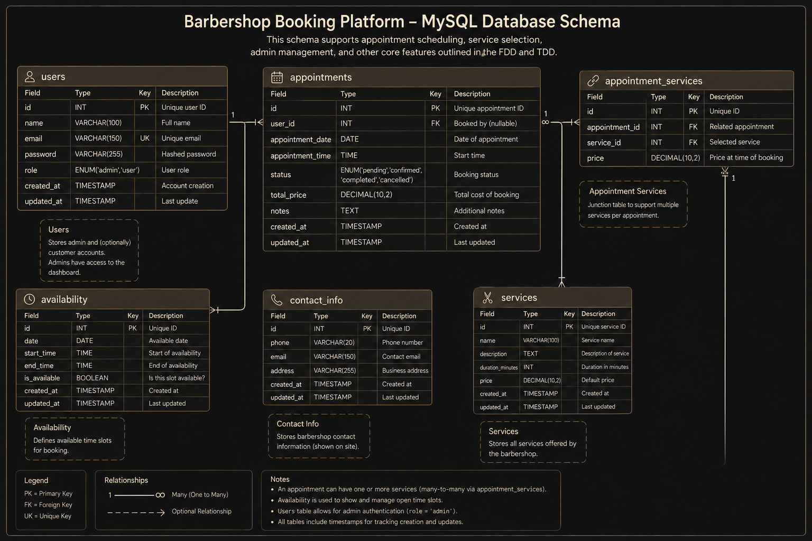

# Technical Design Document (TDD)
Write a brief description of the technical aspects of your project here. Consider:
* Which technologies and tools you will be using (apis, packages, frontend technology, backend technology, database, etc.)
* How the different parts of the application communicate with each other (e.g. API calls, component structure)

## System Architecture
* Browser (User);
  ↓
* Frontend (HTML / TailwindCSS / Vue / Vite / JS);
  ↓
* Backend (Node.js / Express);
  ↓
* Database (MySQL).

## Technical Stack
* HTML;
* TailwindCSS;
* Vue;
* Vite;
* JS;
* Node.js;
* Express;
* MySQL;
* GitHub.

## Deployment
* Vercel.

## Technical Specifications

## Backlog
| Task                     |
|--------------------------|
| https://github.com/orgs/Sint-Lucas/projects/770/views/1 |

### User Acceptance Test (UAT)
Check whether the product meets all functional, design, and code quality requirements from the end user's perspective.

### Test Cases

| Test Case ID | Description                                                            | Steps to Test                                                                                                            | Expected Result                      | Pass/Fail                                |
|--------------|------------------------------------------------------------------------|--------------------------------------------------------------------------------------------------------------------------|--------------------------------------|------------------------------------------|
| 1            | Please navigate to the calendar and tell me which days you can't book. | Click on book appointment (or scroll down). Check the calendar colors, and notice red = most likely occupied.            | Manages to point out red = occupied. | Pass                                     |
| 2            | Please book an appointment for a Haircut.                              | Click on book appointment (or scroll down). Select a vacant timeslot, and select Haircut. Enter information, and submit. | Manages to book an appointment.      | Pass (however also allow the 06 version) |